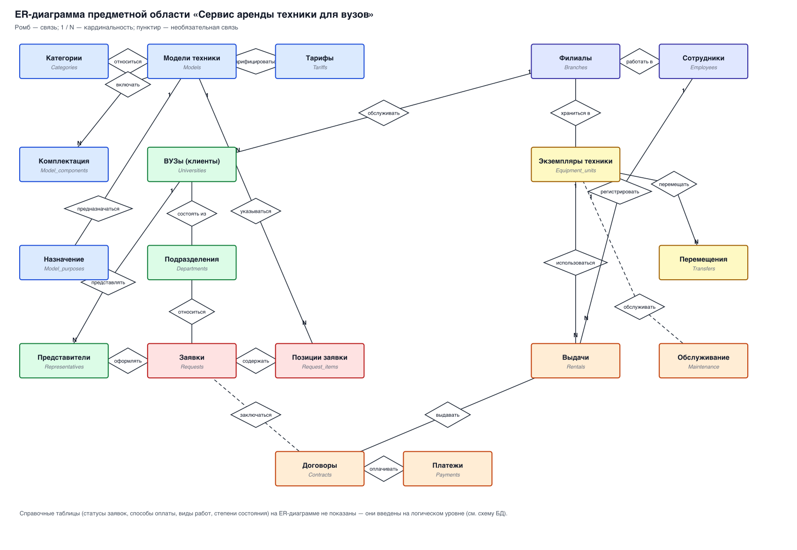

# 2. Инфологическое проектирование

## 2.1. Анализ предметной области

База данных создаётся для информационного обслуживания сотрудников филиалов,
руководства и бухгалтерии компании «CampusRent», а также для взаимодействия с
представителями вузов-арендаторов.

Цель создания БД — хранение и предоставление всех сведений о технике, её
аренде и обслуживании в сети филиалов компании.

### 2.1.1. Особенности предметной области

- Компания имеет центральный офис и несколько филиалов; каждый филиал
  обслуживает вузы своего региона и хранит закреплённую за ним часть парка
  техники.
- Каждый экземпляр техники относится к одной **модели** (типу/номенклатурной
  позиции) и физически находится в одном **филиале**.
- Модели техники объединяются в **категории**; у модели могут быть
  многозначные характеристики: **комплектация** и **назначение (дисциплины)**.
- Для каждой модели на определённый период действует **тариф** — цена аренды в
  расчёте на единицу времени (день/неделя/месяц). Тарифы во времени меняются,
  поэтому у тарифа есть период актуальности.
- Каждый **вуз** обслуживается одним филиалом; у вуза есть **подразделения**
  (факультеты, кафедры, лаборатории) и **представители** — материально
  ответственные лица, которые подают заявки и подписывают договоры.
- **Заявка** подаётся представителем вуза от одного подразделения и содержит
  одну или несколько **позиций** (модель, количество, период).
- Заявка проходит жизненный цикл: *подана → согласована → договор → выполнена*
  (либо *отклонена / отменена*).
- На основании согласованной заявки оформляется **договор аренды**. По договору
  выдаются конкретные **экземпляры** техники; каждый факт выдачи фиксируется с
  указанием состояния при выдаче и при возврате.
- Если в филиале нет свободной техники нужной модели, её можно **забронировать
  в другом филиале** и перевезти (межфилиальная аренда). Перемещения техники
  между филиалами фиксируются.
- По договору регистрируются **платежи**.
- Техника периодически проходит **обслуживание и ремонт**; по завершении
  ремонта состояние экземпляра обновляется, при невозможности восстановления
  экземпляр списывается.
- Учёт ведётся от имени **сотрудников компании**, закреплённых за филиалами.

## 2.2. Выделение сущностей и их атрибутов

Обозначения (в соответствии с методическими указаниями): **полужирным** —
идентифицирующие атрибуты, *курсивом* — многозначные, <u>подчёркнуты</u> —
составные.

### Справочные сущности (НСИ)

1. **Филиалы** (Branches). Атрибуты: **код филиала**, название, город, адрес,
   телефон, e-mail, руководитель, дата открытия, дата закрытия.
2. **Категории техники** (Categories). Атрибуты: **код категории**, название,
   описание.
3. **Модели техники** (Models). Атрибуты: **код модели**, категория,
   производитель, название модели, описание, восстановительная стоимость,
   минимальная партия, *комплектация*, *назначение*.
4. **Тарифы** (Tariffs). Атрибуты: **код тарифа**, модель, единица времени
   аренды, цена, размер залога, дата начала действия, дата окончания действия.
5. **Статусы заявок** (Request_statuses). Атрибуты: **код статуса**, название.
6. **Способы оплаты** (Payment_methods). Атрибуты: **код способа**, название.
7. **Виды обслуживания** (Maintenance_types). Атрибуты: **код вида**, название.
8. **Степени состояния техники** (Condition_grades). Атрибуты: **код степени**,
   название.

### Сущности «Клиенты»

9. **ВУЗы** (Universities). Атрибуты: **код вуза**, полное название, краткое
   название, ИНН, КПП, <u>адрес</u> (город, улица, дом), телефон, e-mail,
   обслуживающий филиал.
10. **Подразделения ВУЗа** (Departments). Атрибуты: **код подразделения**, вуз,
    название, руководитель, телефон, e-mail.
11. **Представители ВУЗов** (Representatives). Атрибуты: **код представителя**,
    вуз, подразделение, ФИО, должность, телефон, e-mail, паспортные данные.

### Сущности «Техника»

12. **Экземпляры техники** (Equipment_units). Атрибуты: **код экземпляра**,
    инвентарный номер, модель, филиал, степень состояния, статус, дата
    приобретения, место размещения, примечание.
13. **Перемещения техники** (Transfers). Атрибуты: **код перемещения**,
    экземпляр, филиал-отправитель, филиал-получатель, дата, причина,
    сопроводительный документ.

### Сущности «Аренда»

14. **Заявки на аренду** (Requests). Атрибуты: **код заявки**, номер заявки,
    вуз, подразделение, представитель, филиал, дата подачи, желаемая дата
    начала, желаемая дата окончания, статус, сумма, комментарий, *позиции
    заявки*.
15. **Позиции заявки** (Request_items). Атрибуты: **код позиции**, заявка,
    модель, количество, дата начала, дата окончания, тариф, стоимость позиции.
16. **Договоры аренды** (Contracts). Атрибуты: **код договора**, номер договора,
    заявка, дата подписания, дата начала, дата окончания, сумма, залог, статус
    договора.
17. **Выдачи экземпляров** (Rentals). Атрибуты: **код выдачи**, договор,
    экземпляр, дата выдачи, плановая дата возврата, фактическая дата возврата,
    состояние при выдаче, состояние при возврате, выдавший сотрудник,
    стоимость по позиции.
18. **Платежи** (Payments). Атрибуты: **код платежа**, договор, дата, сумма,
    способ оплаты, назначение платежа, номер документа.

### Сущности «Сервис и персонал»

19. **Обслуживание и ремонт** (Maintenance). Атрибуты: **код записи**,
    экземпляр, вид работ, дата начала, дата окончания, стоимость, исполнитель,
    результат.
20. **Сотрудники компании** (Employees). Атрибуты: **код сотрудника**, филиал,
    ФИО, должность, телефон, e-mail, логин.

### Сущности, полученные при нормализации

21. **Комплектация модели** (Model_components). Атрибуты: **код записи**,
    модель, комплектующее, количество.
22. **Назначение модели** (Model_purposes). Атрибуты: **код записи**, модель,
    назначение.

> Примечание. У сущности нет атрибутов других сущностей — связи между ними
> реализуются через связи, а не через «чужие» поля. Например, «обслуживающий
> филиал» у вуза — это связь с сущностью «Филиалы», которая может измениться.
> В реляционной БД она реализуется внешним ключом.

## 2.3. Определение связей

| Особенность предметной области | Описание связи | Примечание |
|---|---|---|
| Каждый экземпляр техники относится к одной модели; у модели много экземпляров | **принадлежать**, 1:N между моделями и экземплярами | обязательна со стороны экземпляра |
| Каждая модель относится к одной категории; в категории много моделей | **относиться**, 1:N между категориями и моделями | обязательна со стороны модели |
| У модели много комплектующих | **включать**, 1:N между моделями и комплектацией | таблица `model_components` |
| У модели много назначений (дисциплин) | **предназначаться**, 1:N | таблица `model_purposes` |
| Для каждой модели действует тариф на определённый период | **тарифицироваться**, 1:N | у модели несколько тарифов по единице времени |
| Каждый филиал имеет много сотрудников; сотрудник работает в одном филиале | **работать в**, 1:N | обязательна со стороны сотрудника |
| Каждый экземпляр техники находится в одном филиале | **храниться в**, 1:N | связь определяет фрагментацию |
| Техника перемещается между филиалами | **перемещать**, два отношения 1:N к филиалам | таблица `transfers` |
| Каждый вуз обслуживается одним филиалом | **обслуживать**, 1:N | обязательна со стороны вуза |
| У вуза много подразделений | **состоять из**, 1:N | обязательна с обеих сторон |
| У вуза много представителей | **представлять**, 1:N | обязательна со стороны представителя |
| У вуза много заявок; заявка подаётся одним вузом | **подавать**, 1:N | обязательна со стороны заявки |
| Заявка относится к одному подразделению и оформляется одним представителем | **относиться / оформлять**, 1:N | обязательна |
| Заявка содержит много позиций | **содержать**, 1:N | обязательна в обе стороны |
| У заявки может быть один договор | **заключаться**, 1:1 | необязательна со стороны заявки |
| По договору выдаётся много экземпляров | **выдавать**, 1:N | обязательна со стороны выдачи |
| Экземпляр участвует в нескольких выдачах в разные периоды | **использоваться**, 1:N | обязательна со стороны выдачи |
| По договору может быть несколько платежей | **оплачивать**, 1:N | необязательна со стороны договора |
| Экземпляр многократно проходит обслуживание | **обслуживать**, 1:N | необязательна |
| Лицо, выдавшее технику, — сотрудник | **выдавать**, 1:N | обязательна со стороны выдачи |

## 2.4. ER-диаграмма

ER-диаграмма предметной области приведена на рисунке:

Обозначения: прямоугольник — сущность; ромб — связь; цифры у линий —
кардинальность (1, N, M, K); сплошная линия — обязательная связь, пунктирная —
необязательная. Схема БД, полученная из этой ER-диаграммы, приведена в
`03_Логическое_проектирование.md`.
