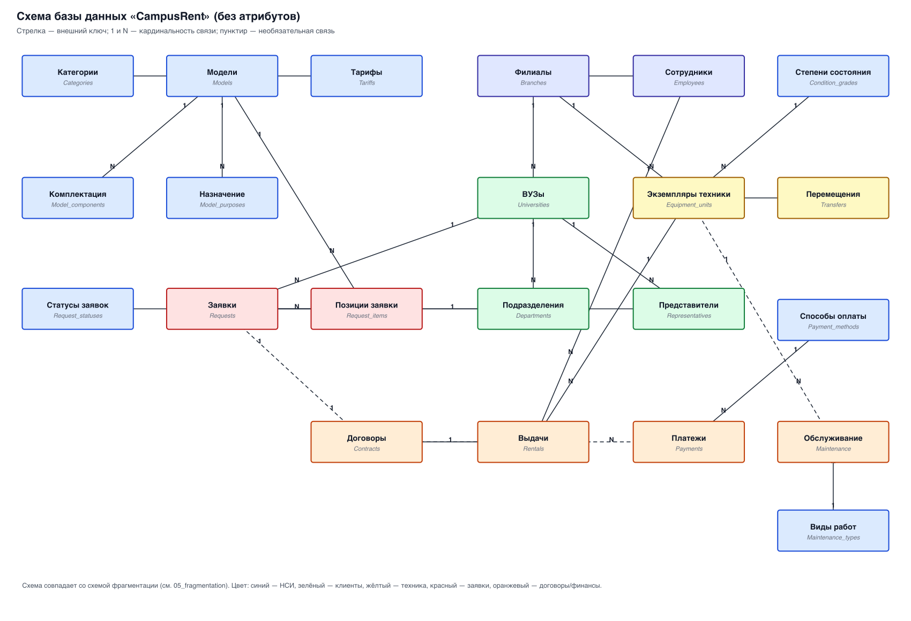
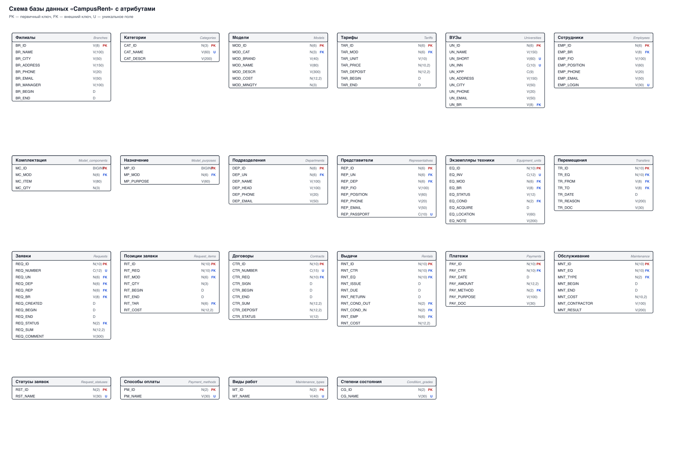

# 3. Логическое проектирование реляционной БД

## 3.1. Преобразование ER-диаграммы в схему базы данных

Преобразование ER-диаграммы в схему БД выполняется путём сопоставления каждой
сущности и каждой связи, имеющей атрибуты, отдельному отношению (таблице) БД.

Правила, использованные при преобразовании:

- **Связь 1:N** реализуется внешним ключом в дочернем отношении. Внешнему ключу
  соответствует первичный или уникальный ключ родительского отношения.
- **Связь M:N** реализуется вспомогательным отношением, содержащим комбинации
  первичных ключей исходных отношений (в проекте таких связей немного, они
  возникают при декомпозиции многозначных атрибутов).
- **Связь 1:1** реализуется внешним ключом с ограничением уникальности
  (например, «заявка — договор», `CTR_REQ` уникален).
- Для отношений без потенциальных ключей вводится **суррогатный первичный
  ключ** (атрибут вида `*_ID`).

### 3.1.1. Разрешение циклов

В схеме возникают циклы ссылок, которые нельзя реализовать «в лоб»:

1. **Цикл `branches → universities → requests → branches`.** Заявка создаётся в
   филиале, обслуживающем вуз, а вуз закреплён за филиалом. Цикл разрешается
   **программно (триггером)**: филиал заявки должен совпадать с обслуживающим
   филиалом вуза (`requests.REQ_BR = universities.UN_BR`).
2. **Цикл `requests → request_items → tariffs → models`.** Тариф должен
   относиться к модели, указанной в позиции заявки. Разрешается **миграцией
   ключей** и проверкой в триггере.
3. **Цикл `contracts → rentals → equipment_units`.** Необходимо, чтобы
   выдаваемый экземпляр был свободен и его модель соответствовала позиции
   заявки. Разрешается **триггером** проверки доступности экземпляра.

Бинарная связь не может быть обязательной с обеих сторон: иначе нельзя добавить
ни одну из записей первой. Поэтому условие обязательности снято со стороны
родительских (ссылочных) отношений, а требование «хотя бы одна дочерняя запись»
реализуется программно (триггером) там, где оно принципиально (заявка должна
иметь хотя бы одну позицию).

### 3.1.2. Схема БД (без атрибутов)

Схема БД с атрибутами (для наглядности вместимости) приведена отдельно:

## 3.2. Составление реляционных отношений

Типы данных обозначаются: **N** — числовой, **C** — символьный фиксированной
длины, **V** — символьный переменной длины, **D** — дата, **DT** — дата и
время.

### 3.2.1. Справочные отношения (НСИ)

**Таблица 1. Схема отношения ФИЛИАЛЫ (Branches)**

| Содержание поля | Имя поля | Тип, длина | Примечания |
|---|---|---|---|
| Код филиала | BR_ID | V(8) | первичный ключ |
| Название | BR_NAME | V(100) | обязательное поле |
| Город | BR_CITY | V(50) | обязательное поле |
| Адрес | BR_ADDRESS | V(150) | обязательное поле |
| Телефон | BR_PHONE | V(20) | |
| E-mail | BR_EMAIL | V(50) | |
| Руководитель | BR_MANAGER | V(100) | |
| Дата открытия | BR_BEGIN | D | обязательное поле |
| Дата закрытия | BR_END | D | завершение периода актуальности |

**Таблица 2. Схема отношения КАТЕГОРИИ (Categories)**

| Содержание поля | Имя поля | Тип, длина | Примечания |
|---|---|---|---|
| Код категории | CAT_ID | N(3) | первичный ключ |
| Название категории | CAT_NAME | V(60) | обязательное уникальное поле |
| Описание | CAT_DESCR | V(200) | |

**Таблица 3. Схема отношения МОДЕЛИ (Models)**

| Содержание поля | Имя поля | Тип, длина | Примечания |
|---|---|---|---|
| Код модели | MOD_ID | N(6) | первичный ключ |
| Категория | MOD_CAT | N(3) | обязательный внешний ключ к Categories |
| Производитель | MOD_BRAND | V(40) | обязательное поле |
| Название модели | MOD_NAME | V(80) | обязательное поле |
| Описание | MOD_DESCR | V(300) | |
| Восстановительная стоимость | MOD_COST | N(12,2) | обязательное поле, > 0 |
| Минимальная партия | MOD_MINQTY | N(3) | обязательное, по умолчанию 1 |
| | | | уникальная пара (MOD_BRAND, MOD_NAME) |

**Таблица 4. Схема отношения КОМПЛЕКТАЦИЯ МОДЕЛИ (Model_components)**

| Содержание поля | Имя поля | Тип, длина | Примечания |
|---|---|---|---|
| Код записи | MC_ID | N(10) | суррогатный первичный ключ |
| Модель | MC_MOD | N(6) | обязательный внешний ключ к Models |
| Комплектующее | MC_ITEM | V(80) | обязательное поле |
| Количество | MC_QTY | N(3) | по умолчанию 1 |
| | | | уникальная пара (MC_MOD, MC_ITEM) |

**Таблица 5. Схема отношения НАЗНАЧЕНИЕ МОДЕЛИ (Model_purposes)**

| Содержание поля | Имя поля | Тип, длина | Примечания |
|---|---|---|---|
| Код записи | MP_ID | N(10) | суррогатный первичный ключ |
| Модель | MP_MOD | N(6) | обязательный внешний ключ к Models |
| Назначение | MP_PURPOSE | V(60) | обязательное поле |
| | | | уникальная пара (MP_MOD, MP_PURPOSE) |

**Таблица 6. Схема отношения ТАРИФЫ (Tariffs)**

| Содержание поля | Имя поля | Тип, длина | Примечания |
|---|---|---|---|
| Код тарифа | TAR_ID | N(6) | первичный ключ |
| Модель | TAR_MOD | N(6) | обязательный внешний ключ к Models |
| Единица времени аренды | TAR_UNIT | V(10) | обязательное: 'день'/'неделя'/'месяц' |
| Цена | TAR_PRICE | N(10,2) | обязательное поле, > 0 |
| Залог | TAR_DEPOSIT | N(12,2) | по умолчанию 0, ≥ 0 |
| Дата начала действия | TAR_BEGIN | D | обязательное поле |
| Дата окончания действия | TAR_END | D | необязательное, > TAR_BEGIN |
| | | | уникальная тройка (TAR_MOD, TAR_UNIT, TAR_BEGIN) |

**Таблицы 7–10. Схемы отношений-справочников**

| Отношение | Имя поля | Тип | Примечания |
|---|---|---|---|
| СТАТУСЫ ЗАЯВОК (Request_statuses) | RST_ID | N(2) | первичный ключ |
| | RST_NAME | V(30) | обязательное уникальное поле |
| СПОСОБЫ ОПЛАТЫ (Payment_methods) | PM_ID | N(2) | первичный ключ |
| | PM_NAME | V(30) | обязательное уникальное поле |
| ВИДЫ ОБСЛУЖИВАНИЯ (Maintenance_types) | MT_ID | N(2) | первичный ключ |
| | MT_NAME | V(40) | обязательное уникальное поле |
| СТЕПЕНИ СОСТОЯНИЯ (Condition_grades) | CG_ID | N(2) | первичный ключ |
| | CG_NAME | V(30) | обязательное уникальное поле |

### 3.2.2. Отношения «Клиенты»

Потенциальными ключами отношения ВУЗЫ являются поля Краткое название и ИНН.
ИНН занимает меньше места, но может измениться при реорганизации, поэтому
введён суррогатный первичный ключ.

**Таблица 11. Схема отношения ВУЗЫ (Universities)**

| Содержание поля | Имя поля | Тип, длина | Примечания |
|---|---|---|---|
| Код вуза | UN_ID | N(6) | суррогатный первичный ключ |
| Полное название | UN_NAME | V(150) | обязательное поле |
| Краткое название | UN_SHORT | V(60) | обязательное уникальное поле |
| ИНН | UN_INN | C(10) | обязательное уникальное поле |
| КПП | UN_KPP | C(9) | |
| Адрес | UN_ADDRESS | V(150) | обязательное поле |
| Город | UN_CITY | V(50) | обязательное поле |
| Телефон | UN_PHONE | V(20) | |
| E-mail | UN_EMAIL | V(50) | |
| Обслуживающий филиал | UN_BR | V(8) | обязательный внешний ключ к Branches |

**Таблица 12. Схема отношения ПОДРАЗДЕЛЕНИЯ (Departments)**

| Содержание поля | Имя поля | Тип, длина | Примечания |
|---|---|---|---|
| Код подразделения | DEP_ID | N(6) | первичный ключ |
| Вуз | DEP_UN | N(6) | обязательный внешний ключ к Universities |
| Название | DEP_NAME | V(100) | обязательное поле |
| Руководитель | DEP_HEAD | V(100) | |
| Телефон | DEP_PHONE | V(20) | |
| E-mail | DEP_EMAIL | V(50) | |
| | | | уникальная пара (DEP_UN, DEP_NAME) |

**Таблица 13. Схема отношения ПРЕДСТАВИТЕЛИ (Representatives)**

| Содержание поля | Имя поля | Тип, длина | Примечания |
|---|---|---|---|
| Код представителя | REP_ID | N(6) | первичный ключ |
| Вуз | REP_UN | N(6) | обязательный внешний ключ к Universities |
| Подразделение | REP_DEP | N(6) | внешний ключ к Departments |
| ФИО | REP_FIO | V(100) | обязательное поле |
| Должность | REP_POSITION | V(60) | обязательное поле |
| Телефон | REP_PHONE | V(20) | обязательное поле |
| E-mail | REP_EMAIL | V(50) | |
| Паспорт (серия и номер) | REP_PASSPORT | C(10) | уникальное поле |

### 3.2.3. Отношения «Техника»

Модель и филиал не являются характеристиками экземпляра «сами по себе» — это
связи, поэтому в экземпляре хранятся только их внешние ключи.

**Таблица 14. Схема отношения ЭКЗЕМПЛЯРЫ ТЕХНИКИ (Equipment_units)**

| Содержание поля | Имя поля | Тип, длина | Примечания |
|---|---|---|---|
| Код экземпляра | EQ_ID | N(10) | первичный ключ |
| Инвентарный номер | EQ_INV | C(12) | обязательное уникальное поле |
| Модель | EQ_MOD | N(6) | обязательный внешний ключ к Models |
| Филиал | EQ_BR | V(8) | обязательный внешний ключ к Branches (фрагментация) |
| Статус | EQ_STATUS | V(12) | 'свободна'/'аренда'/'бронь'/'обслуживание'/'списана' |
| Степень состояния | EQ_COND | N(2) | обязательный внешний ключ к Condition_grades |
| Дата приобретения | EQ_ACQUIRE | D | обязательное поле |
| Место размещения | EQ_LOCATION | V(60) | склад/аудитория |
| Примечание | EQ_NOTE | V(200) | |

**Таблица 15. Схема отношения ПЕРЕМЕЩЕНИЯ (Transfers)**

| Содержание поля | Имя поля | Тип, длина | Примечания |
|---|---|---|---|
| Код перемещения | TR_ID | N(10) | первичный ключ |
| Экземпляр | TR_EQ | N(10) | обязательный внешний ключ к Equipment_units |
| Филиал-отправитель | TR_FROM | V(8) | обязательный внешний ключ к Branches |
| Филиал-получатель | TR_TO | V(8) | обязательный внешний ключ к Branches |
| Дата | TR_DATE | D | обязательное поле |
| Причина | TR_REASON | V(200) | |
| Документ | TR_DOC | V(30) | |
| | | | TR_FROM ≠ TR_TO |

### 3.2.4. Отношения «Аренда»

**Таблица 16. Схема отношения ЗАЯВКИ (Requests)**

| Содержание поля | Имя поля | Тип, длина | Примечания |
|---|---|---|---|
| Код заявки | REQ_ID | N(10) | первичный ключ |
| Номер заявки | REQ_NUMBER | C(12) | обязательное уникальное поле |
| Вуз | REQ_UN | N(6) | обязательный внешний ключ к Universities |
| Подразделение | REQ_DEP | N(6) | обязательный внешний ключ к Departments |
| Представитель | REQ_REP | N(6) | обязательный внешний ключ к Representatives |
| Филиал | REQ_BR | V(8) | обязательный внешний ключ к Branches |
| Дата подачи | REQ_CREATED | D | обязательное поле |
| Желаемая дата начала | REQ_BEGIN | D | обязательное поле |
| Желаемая дата окончания | REQ_END | D | обязательное поле, > REQ_BEGIN |
| Статус | REQ_STATUS | N(2) | обязательный внешний ключ к Request_statuses |
| Сумма | REQ_SUM | N(12,2) | по умолчанию 0 |
| Комментарий | REQ_COMMENT | V(300) | |

**Таблица 17. Схема отношения ПОЗИЦИИ ЗАЯВКИ (Request_items)**

| Содержание поля | Имя поля | Тип, длина | Примечания |
|---|---|---|---|
| Код позиции | RIT_ID | N(10) | суррогатный первичный ключ |
| Заявка | RIT_REQ | N(10) | обязательный внешний ключ к Requests |
| Модель | RIT_MOD | N(6) | обязательный внешний ключ к Models |
| Количество | RIT_QTY | N(3) | обязательное поле, > 0 |
| Дата начала | RIT_BEGIN | D | обязательное поле |
| Дата окончания | RIT_END | D | обязательное поле, > RIT_BEGIN |
| Тариф | RIT_TAR | N(6) | обязательный внешний ключ к Tariffs |
| Стоимость позиции | RIT_COST | N(12,2) | обязательное поле, ≥ 0 |
| | | | уникальная тройка (RIT_REQ, RIT_MOD, RIT_BEGIN) |

**Таблица 18. Схема отношения ДОГОВОРЫ (Contracts)**

| Содержание поля | Имя поля | Тип, длина | Примечания |
|---|---|---|---|
| Код договора | CTR_ID | N(10) | первичный ключ |
| Номер договора | CTR_NUMBER | C(15) | обязательное уникальное поле |
| Заявка | CTR_REQ | N(10) | обязательный уникальный внешний ключ к Requests (связь 1:1) |
| Дата подписания | CTR_SIGN | D | обязательное поле |
| Дата начала | CTR_BEGIN | D | обязательное поле |
| Дата окончания | CTR_END | D | обязательное поле, > CTR_BEGIN |
| Сумма | CTR_SUM | N(12,2) | обязательное поле, > 0 |
| Залог | CTR_DEPOSIT | N(12,2) | по умолчанию 0, ≥ 0 |
| Статус | CTR_STATUS | V(12) | 'действует'/'закрыт'/'расторгнут' |

**Таблица 19. Схема отношения ВЫДАЧИ (Rentals)**

| Содержание поля | Имя поля | Тип, длина | Примечания |
|---|---|---|---|
| Код выдачи | RNT_ID | N(10) | первичный ключ |
| Договор | RNT_CTR | N(10) | обязательный внешний ключ к Contracts |
| Экземпляр | RNT_EQ | N(10) | обязательный внешний ключ к Equipment_units |
| Дата выдачи | RNT_ISSUE | D | обязательное поле |
| Плановая дата возврата | RNT_DUE | D | обязательное поле, ≥ RNT_ISSUE |
| Фактическая дата возврата | RNT_RETURN | D | ≥ RNT_ISSUE |
| Состояние при выдаче | RNT_COND_OUT | N(2) | обязательный внешний ключ к Condition_grades |
| Состояние при возврате | RNT_COND_IN | N(2) | внешний ключ к Condition_grades |
| Выдавший сотрудник | RNT_EMP | N(6) | обязательный внешний ключ к Employees |
| Стоимость | RNT_COST | N(12,2) | ≥ 0 |
| | | | уникальная пара (RNT_EQ, RNT_ISSUE) |

**Таблица 20. Схема отношения ПЛАТЕЖИ (Payments)**

| Содержание поля | Имя поля | Тип, длина | Примечания |
|---|---|---|---|
| Код платежа | PAY_ID | N(10) | первичный ключ |
| Договор | PAY_CTR | N(10) | обязательный внешний ключ к Contracts |
| Дата | PAY_DATE | D | обязательное поле |
| Сумма | PAY_AMOUNT | N(12,2) | обязательное поле, > 0 |
| Способ оплаты | PAY_METHOD | N(2) | обязательный внешний ключ к Payment_methods |
| Назначение | PAY_PURPOSE | V(100) | |
| Документ | PAY_DOC | V(30) | |

### 3.2.5. Отношения «Сервис и персонал»

**Таблица 21. Схема отношения ОБСЛУЖИВАНИЕ (Maintenance)**

| Содержание поля | Имя поля | Тип, длина | Примечания |
|---|---|---|---|
| Код записи | MNT_ID | N(10) | первичный ключ |
| Экземпляр | MNT_EQ | N(10) | обязательный внешний ключ к Equipment_units |
| Вид работ | MNT_TYPE | N(2) | обязательный внешний ключ к Maintenance_types |
| Дата начала | MNT_BEGIN | D | обязательное поле |
| Дата окончания | MNT_END | D | ≥ MNT_BEGIN |
| Стоимость | MNT_COST | N(10,2) | по умолчанию 0, ≥ 0 |
| Исполнитель | MNT_CONTRACTOR | V(100) | |
| Результат | MNT_RESULT | V(200) | |

**Таблица 22. Схема отношения СОТРУДНИКИ (Employees)**

| Содержание поля | Имя поля | Тип, длина | Примечания |
|---|---|---|---|
| Код сотрудника | EMP_ID | N(6) | первичный ключ |
| Филиал | EMP_BR | V(8) | обязательный внешний ключ к Branches |
| ФИО | EMP_FIO | V(100) | обязательное поле |
| Должность | EMP_POSITION | V(60) | обязательное поле |
| Телефон | EMP_PHONE | V(20) | |
| E-mail | EMP_EMAIL | V(50) | |
| Логин | EMP_LOGIN | V(30) | обязательное уникальное поле (для прав доступа) |

## 3.3. Нормализация полученных отношений (до 4НФ)

### 3.3.1. Приведение к первой нормальной форме (1НФ)

Все атрибуты приведены к простому (атомарному) виду; составные атрибуты
разбиты, многозначные вынесены в отдельные отношения.

| Исходный составной/многозначный атрибут | Действие |
|---|---|
| `Адрес вуза` | разбит на `UN_CITY` и `UN_ADDRESS` |
| `Паспортные данные` представителя | сведены к одному атомарному полю `REP_PASSPORT` |
| `Комплектация модели` (многозначный) | вынесена в отношение `model_components` |
| `Назначение модели` (многозначный) | вынесено в отношение `model_purposes` |
| `Позиции заявки` (многозначный) | вынесены в отношение `request_items` |

### 3.3.2. Приведение ко второй нормальной форме (2НФ)

Отношения с простым первичным ключом сразу находятся во 2НФ. Рассмотрим
отношение с составным ключом — предварительное отношение
`ПОЗИЦИЯ_ЗАЯВКИ(REQ_ID, MOD_ID, TAR_ID, QTY, PRICE)`, где первичный ключ —
`(REQ_ID, MOD_ID)`. Атрибут `PRICE` (цена аренды) зависит **только от `TAR_ID`**,
то есть от части составного ключа (через тариф), — это частичная зависимость.

Устранение: цена переносится в справочное отношение `tariffs`, а в позиции
заявки остаётся ссылка `RIT_TAR` на тариф. В итоговом отношении
`request_items` неключевые атрибуты (`RIT_QTY`, `RIT_COST`) функционально полно
зависят от суррогатного ключа `RIT_ID`.

### 3.3.3. Приведение к третьей нормальной форме (3НФ)

Устранены транзитивные зависимости неключевых атрибутов от первичного ключа.

| Исходная зависимость | Устранение |
|---|---|
| `EQ_ID → MOD_ID → MOD_NAME, MOD_BRAND, CAT_ID` | характеристики модели перенесены в `models`; в `equipment_units` остался только `EQ_MOD` |
| `MOD_ID → CAT_ID → CAT_NAME` | название категории перенесено в `categories`; в `models` остался `MOD_CAT` |
| `REQ_ID → UN_ID → UN_NAME, UN_INN, UN_CITY` | данные вуза перенесены в `universities`; в `requests` остался `REQ_UN` |
| `DEP_ID → UN_ID` | вуз подразделения хранится как внешний ключ `DEP_UN` |

**Исключение (намеренная денормализация).** Поля `REQ_SUM` и `CTR_SUM` —
вычислимые (сумма стоимостей позиций / платежей), но они являются базовыми для
документов (в заявке и договоре сумма фигурирует как согласованная величина,
независимая от последующих изменений). Эти поля оставлены, а их согласованность
с позициями контролируется триггером. Это единственная осознанная
денормализация, обоснованная требованиями к достоверности документов.

### 3.3.4. Приведение к четвёртой нормальной форме (4НФ)

Рассмотрим предварительное отношение
`ХАРАКТЕРИСТИКИ_МОДЕЛИ(MOD_ID, COMPONENT, PURPOSE)`, где `COMPONENT` — элемент
комплектации, `PURPOSE` — назначение (дисциплина). Здесь присутствуют **две
независимые многозначные зависимости**: `MOD_ID ↠ COMPONENT` и
`MOD_ID ↠ PURPOSE`. Такое отношение нарушает 4НФ и порождает аномалии
обновления (нельзя добавить комплектующее, не указав назначение).

Декомпозиция выполнена по правилу: строятся две проекции, каждая из которых
содержит ключ и одну многозначную зависимость:

- `model_components(MOD_ID, COMPONENT, QTY)`;
- `model_purposes(MOD_ID, PURPOSE)`.

**Замечание (аналогично примеру в методических указаниях).** В отношении
`representatives` поля `REP_PHONE` и `REP_EMAIL` также образуют две
многозначные зависимости (у представителя может быть несколько телефонов и
несколько адресов). Эти сведения носят справочный характер, автоматической
обработки по ним не требуется, поэтому дополнительная декомпозиция не
проводится — это допустимое исключение, как «Адреса-Телефоны» в примере.

## 3.4. Определение дополнительных ограничений целостности

Ограничения, не выраженные в схеме отношений и реализуемые программно
(триггерами или приложением):

1. **`requests.REQ_BR` должен совпадать с `universities.UN_BR`** — заявка
   обслуживается филиалом, к которому прикреплён вуз.
2. **`requests.REQ_DEP` должен принадлежать `requests.REQ_UN`**, а
   `representatives.REP_UN` — тому же вузу (согласованность подразделения,
   представителя и вуза).
3. **Позиция заявки ссылается на тариф той же модели**: `tariffs.TAR_MOD =`
   `request_items.RIT_MOD`.
4. **Период позиции должен укладываться в период заявки**, а период тарифа —
   покрывать период аренды.
5. **Один экземпляр техники не может быть выдан двум арендаторам
   одновременно**: периоды выдач одного экземпляра не должны пересекаться.
6. **Выдаваемый экземпляр должен быть свободен** (`EQ_STATUS = 'свободна'` или
   `'бронь'` под этот договор) и принадлежать филиалу, оформляющему выдачу.
7. **Модель выдаваемого экземпляра должна соответствовать позиции заявки.**
8. **Сумма стоимостей позиций заявки должна равняться `requests.REQ_SUM`.**
9. **Сумма по договору должна равняться сумме стоимостей его выдач.**
10. **Справочные значения актуальны**: ссылаться на запись тарифа можно только
    тогда, когда событие относится к периоду его актуальности
    (`TAR_BEGIN ≤ дата события ≤ TAR_END`).
11. **Статус экземпляра автоматически меняется** при выдаче (`аренда`), возврате
    (`свободна`), отправке в ремонт (`обслуживание`) и списании (`списана`).
12. **Заявка не может стать «договор»** без оформленного договора с позициями.

Ограничения 1–5 и 8–11 реализованы триггерами в `sql/05_triggers.sql`;
ограничения 6–7 — также триггером `check_rental_available`.

## 3.5. Описание групп пользователей и прав доступа

Обозначения прав: **S** (select) — чтение, **I** (insert) — добавление,
**U** (update) — изменение, **D** (delete) — удаление.

Права распределены так, чтобы для каждого объекта нашёлся пользователь,
имеющий право добавлять и удалять данные.

**Таблица 3.5.1. Права доступа к таблицам**

| Таблица | Менеджер филиала | Склад филиала | Сервис | Руководитель филиала | Представитель ВУЗа | Сотрудник ЦО | Руководство ЦО | Бухгалтерия |
|---|---|---|---|---|---|---|---|---|
| branches | S | S | S | S | S | SUID | S | S |
| categories | S | S | S | S | S | SUID | S | |
| models | S | S | S | S | S | SUID | S | |
| model_components | S | S | S | S | S | SUID | S | |
| model_purposes | S | S | S | S | S | SUID | S | |
| tariffs | S | S | S | S | S | SUID | S | S |
| request_statuses | S | S | S | S | S | SUID | S | |
| payment_methods | S | S | S | S | | SUID | S | S |
| maintenance_types | S | S | S | S | | SUID | S | |
| condition_grades | S | S | S | S | | SUID | S | |
| universities | SUI | S | S | S | S | SUID | S | S |
| departments | SUI | S | S | S | S | SUID | S | |
| representatives | SUI | S | S | S | S | SUID | S | |
| equipment_units | SUI* | SUID | SU | S | | SUID | S | |
| transfers | SI | SUID | S | S | | S | S | |
| requests | SUID* | S | | S | SIU* | S | S | S |
| request_items | SUID* | S | | S | SIU* | S | S | |
| contracts | SUID* | | | S | S* | S | S | S |
| rentals | SUID* | S | S | S | | S | S | S |
| payments | SUI* | | | S | | S | S | SUID |
| maintenance | S | SI | SUID | S | | S | S | S |
| employees | S | S | S | S | | SUID | S | |

`*` — права ограничены рамками своего филиала (для менеджера и склада) или
своего вуза (для представителя). Это реализуется через **представления с
фильтрацией по пользователю и флагом `WITH CHECK OPTION`** (см. п. 3.6 и
`sql/04_views.sql`).

Права руководителей проектов/филиалов на изменение данных назначаются через
представления, т.к. они могут изменять данные только по своим объектам.

## 3.6. Представления (готовые запросы), используемые для разграничения доступа

| Представление | Назначение | Кому доступно |
|---|---|---|
| `v_my_branch_equipment` | техника своего филиала | склад/менеджер филиала |
| `v_my_branch_requests` | заявки своего филиала | менеджер филиала, руководство филиала |
| `v_my_university_requests` | заявки своего вуза | представитель ВУЗа |
| `v_my_university_contracts` | договоры своего вуза | представитель ВУЗа |
| `v_current_rentals` | текущие (не возвращённые) выдачи | все сотрудники |
| `v_available_equipment` | свободная техника по филиалам | все сотрудники |
| `v_overdue_rentals` | просроченные возвраты | руководство, менеджеры |
| `v_consolidated_fleet` | сводный парк по филиалам (консолидированная копия) | ЦО |

Определения представлений приведены в `sql/04_views.sql`.
