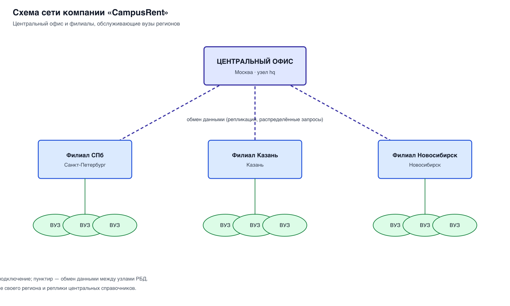
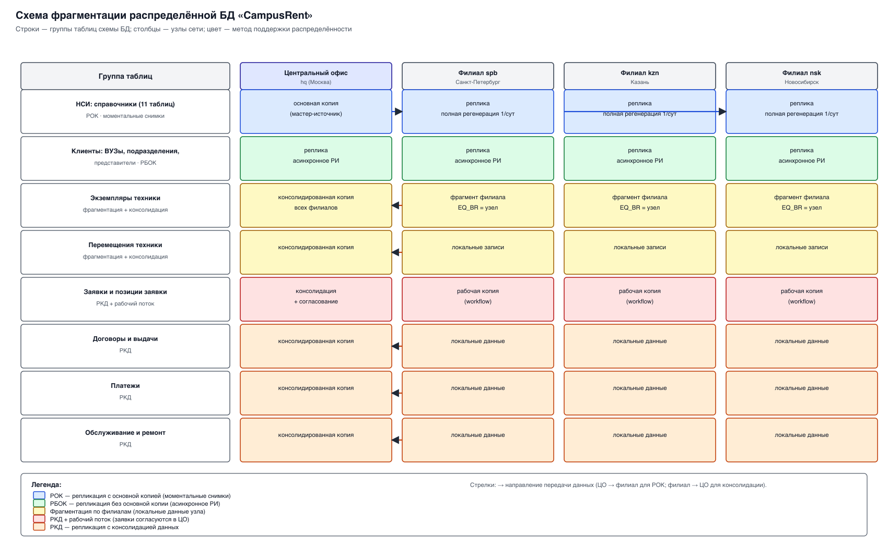

# 4. Распределённая БД: схема фрагментации и методы поддержки распределённости

## 4.1. Структура узлов сети

Распределённая БД разворачивается на узлах сети компании «CampusRent»:
центральный офис (ЦО) и филиалы. Каждый узел имеет собственный сервер СУБД.

| Узел | Расположение | Роль | Обслуживает вузы |
|---|---|---|---|
| `hq` (ЦО) | Москва | центральный узел: НСИ, консолидация, отчётность | Москва и МО |
| `spb` | Санкт-Петербург | филиал | вузы Санкт-Петербурга и СЗФО |
| `kzn` | Казань | филиал | вузы Поволжья |
| `nsk` | Новосибирск | филиал | вузы Сибири |

Сеть полносвязная по смыслу (каждый филиал обменивается данными с ЦО), но
физически необязательно полносвязная — достаточно наличия маршрута между
узлами. Филиалы взаимодействуют с ЦО напрямую; прямой обмен «филиал-филиал»
используется только в распределённых транзакциях бронирования.



## 4.2. Классификация таблиц по способу поддержки распределённости

Все отношения разбиты на группы, для каждой из которых выбран свой метод
поддержки распределённости.

| № | Группа таблиц | Метод поддержки распределённости |
|---|---|---|
| A | НСИ: `branches`, `categories`, `models`, `model_components`, `model_purposes`, `tariffs`, `request_statuses`, `payment_methods`, `maintenance_types`, `condition_grades`, `employees` | Репликация **с основной копией (РОК)** на основе моментальных снимков, полная регенерация 1 раз в сутки. Источник — ЦО, приёмники — филиалы |
| B | Клиенты: `universities`, `departments`, `representatives` | Репликация **без основной копии (РБОК)** с асинхронным распространением изменений между всеми узлами |
| C | Техника: `equipment_units`, `transfers` | **Горизонтальная фрагментация** по филиалу (учёт ведётся в узле-владельце) + **репликация с консолидацией (РКД)** в ЦО |
| D | Заявки: `requests`, `request_items` | **РКД + рабочий поток (workflow)**: заявка создаётся в филиале, согласуется в ЦО, возвращается в филиал |
| E | Договоры и финансы: `contracts`, `rentals`, `payments` | Локально в филиале + **репликация с консолидацией (РКД)** в ЦО (централизованная бухгалтерия и отчётность) |
| F | Сервис: `maintenance` | Локально в филиале + **РКД** в ЦО (сводный учёт затрат на ремонт) |

Обозначения: РОК — репликация с основной копией; РБОК — репликация без основной
копии; РКД — репликация с консолидацией данных; МС — моментальные снимки;
РИ — распространение изменений; вертикальной фрагментации нет (обоснование в
п. 4.4).

## 4.3. Схема фрагментации



Легенда к схеме фрагментации:

| Цвет/обозначение | Метод |
|---|---|
| синий | РОК, моментальные снимки, полная регенерация 1 раз в сутки (источник — ЦО) |
| зелёный | РБОК, асинхронное распространение изменений |
| оранжевый | РКД, консолидация 1 раз в сутки |
| красный | РКД + рабочий поток (двунаправленное движение заявки) |
| жёлтый | фрагментация по филиалам (локальные данные узла) |

### 4.3.1. Определение фрагментов

**Горизонтальная фрагментация** таблицы `equipment_units` по атрибуту `EQ_BR`:

```
EQ_spb = σ(EQ_BR = 'SPB')(equipment_units)
EQ_kzn = σ(EQ_BR = 'KZN')(equipment_units)
EQ_nsk = σ(EQ_BR = 'NSK')(equipment_units)
полнота: equipment_units = EQ_spb ∪ EQ_kzn ∪ EQ_nsk
```

Аналогично фрагментируются производные от неё таблицы `transfers`, `rentals`,
`maintenance` — по филиалу владельца экземпляра.

Каждый филиал хранит **только свой фрагмент**; консолидированная копия всех
фрагментов хранится в ЦО (таблица-приёмник консолидации).

## 4.4. Обоснование выбора методов

1. **Справочные таблицы (группа A).** Формируются централизованно в ЦО, имеют
   небольшой размер и меняются редко (несколько раз в месяц). Изменения не
   критичны к задержке, зато важна их согласованность на всех узлах. Поэтому
   выбрана репликация с основной копией на основе моментальных снимков с полной
   регенерацией раз в сутки: филиал в любой момент имеет актуальный (в пределах
   суток) справочник для оформления операций.

2. **Клиенты (группа B).** Вуз может быть зарегистрирован в любом филиале
   (например, при обращении по месту проведения мероприятия), и его данные
   должны быть видны во всех узлах для проверки и повторного использования.
   Поскольку источник изменений не един, применяется **репликация без основной
   копии** с асинхронным распространением изменений. Возникающие конфликты
   разрешаются по правилам п. 4.7.

3. **Техника (группа C).** Экземпляр физически находится в конкретном филиале и
   изменяется (выдаётся, возвращается, ремонтируется) именно там. Хранение
   сведений о нём в том же узле обеспечивает работу филиала при обрыве связи с
   ЦО. Это естественная **горизонтальная фрагментация**. При этом руководству
   сети нужен сводный учёт — поэтому фрагменты **консолидируются** в ЦО.

4. **Заявки (группа D).** Заявка создаётся в филиале, но требует согласования и
   межфилиального подбора техники в ЦО. Это классический **рабочий поток**:
   права на изменение записи переходят от филиала к ЦО и обратно по мере смены
   статуса заявки, а сами данные консолидируются.

5. **Договоры и финансы (группа E).** Оформляются в филиале, но бухгалтерский
   учёт централизован. Выбрана **консолидация в ЦО раз в сутки**: филиал
   работает автономно, а ЦО получает полную финансовую картину.

6. **Сервис (группа F).** Работы ведутся в филиале, но затраты на ремонт
   интересуют руководство сети — применяется консолидация.

**Почему не используется вертикальная фрагментация.** Вертикальная
фрагментация потребовала бы распределённых соединений по каждому запросу к
технике и заявкам, что резко усложнило бы приложение и снизило
производительность, тогда как объёмы данных на узел невелики. Горизонтальная
фрагментация + репликация дают нужный баланс автономности и согласованности.

## 4.5. Репликация: источники и приёмники

| Группа | Источник данных | Приёмник | Режим |
|---|---|---|---|
| A (НСИ) | ЦО (`hq`) | филиалы `spb`, `kzn`, `nsk` | РОК, моментальные снимки, полная регенерация 1 р/сутки |
| B (клиенты) | любой узел | все остальные узлы | РБОК, асинхронное РИ |
| C (техника) | каждый филиал | ЦО | РКД, регенерация 1 р/сутки |
| D (заявки) | филиал ↔ ЦО | ЦО; филиал | РКД + рабочий поток |
| E (договоры, финансы) | каждый филиал | ЦО | РКД, 1 р/сутки |
| F (сервис) | каждый филиал | ЦО | РКД, 1 р/сутки |

В терминах MySQL:

- **РОК** реализуется как `master → slave`: ЦО — источник (master), филиалы —
  приёмники (slave); реплицируются таблицы группы A (`binlog-do-db` +
  `replicate-do-table`).
- **РБОК** реализуется двунаправленной репликацией таблиц группы B между узлами
  (каждый узел является и master, и slave для этих таблиц).
- **Консолидация** реализуется на выделенном узле `consol` (или в ЦО), который
  подключается каналами к каждому филиалу и собирает их фрагменты.

## 4.6. Распределённые запросы

**РЗ-1. Поиск свободной техники заданной модели по всем филиалам.**
Формулировка: «В каких филиалах есть свободные экземпляры модели *M* на период
*[d1, d2]*?»

Декомпозиция запроса:
1. на каждом узле выполняется локальный подзапрос
   `σ(EQ_MOD = M ∧ EQ_STATUS = 'свободна')` по своему фрагменту;
2. результаты объединяются (`UNION ALL`) на узле-инициаторе.

Отказоустойчивость: если узел не ответил, запрос повторяется по всем остальным
узлам; если и это не удалось — выполняются отдельные удалённые запросы к каждому
узлу с игнорированием ошибок, результат собирается от ответивших узлов.

**РЗ-2. Сводная отчётность по сети.** Формируется по консолидированным копиям
таблиц в ЦО (загрузка парка, выручка по филиалам, затраты на ремонт).

**РЗ-3. Проверка договора вуза.** Представитель вуза, зарегистрированный в
филиале `spb`, видит свои договоры; если договор оформлен в другом филиале,
запрос направляется к консолидированной копии в ЦО.

## 4.7. Распределённые транзакции

**РТ-1. Межфилиальное бронирование экземпляра.**
Ситуация: филиалу `nsk` для заявки вуза нужна модель, свободные экземпляры
которой есть только в `spb`.
Транзакция (двухфазная фиксация, протокол 2PC):
1. координатор (узел `nsk`) отправляет на узел `spb` команду
   `UPDATE equipment_units SET EQ_STATUS='бронь' WHERE EQ_ID=... AND EQ_STATUS='свободна'`;
2. узел `spb` блокирует строку и подтверждает готовность (`PREPARE`);
3. координатор фиксирует у себя создание брони/позиции заявки;
4. при подтверждении всех участников выполняется `COMMIT` на обоих узлах, иначе —
   `ROLLBACK`.
Гарантируется, что экземпляр не будет одновременно забронирован двумя
заявками.

**РТ-2. Перенос техники между филиалами.**
Транзакция изменяет `EQ_BR` экземпляра на узле-получателе, создаёт запись в
`transfers` и закрывает бронь на узле-отправителе. Обе стороны фиксируются
атомарно.

**РТ-3. Согласование заявки (рабочий поток).**
Смена статуса заявки выполняется согласованно: запись блокируется на узле
филиала, передаётся в ЦО, там изменяется статус и подбирается техника, затем
запись возвращается в филиал с обновлённым статусом.

## 4.8. Разрешение конфликтов репликации

Конфликты возможны только для группы B (клиенты, РБОК), так как остальные
группы имеют одного владельца (ЦО или конкретный филиал).

Правила разрешения:

1. **Конфликт добавления** (в двух узлах зарегистрирован один вуз с одинаковым
   ИНН). Уникальный ключ `UN_INN` не даёт продублировать запись; вновь
   поступившая запись связывается с существующей (слияние по ИНН), а не
   вставляется повторно.
2. **Конфликт изменения** (запись изменена в разных узлах). Побеждает изменение
   с более поздней меткой времени; при равенстве времени приоритет у изменения,
   пришедшего из ЦО.
3. **Конфликт удаления.** Удаление выполняется «мягко» (логическое удаление
   признаком активности), чтобы его можно было отличить от отсутствия записи.

Для реализации правила 1 в таблице `universities` введён уникальный индекс по
`UN_INN`; правила 2–3 предусматривают служебные поля (метка времени,
признак активности), добавляемые на этапе развёртывания репликации.
